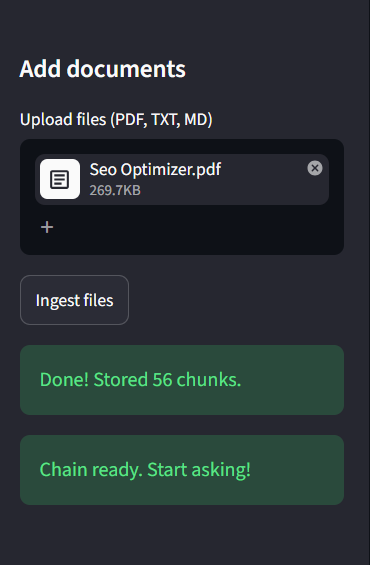
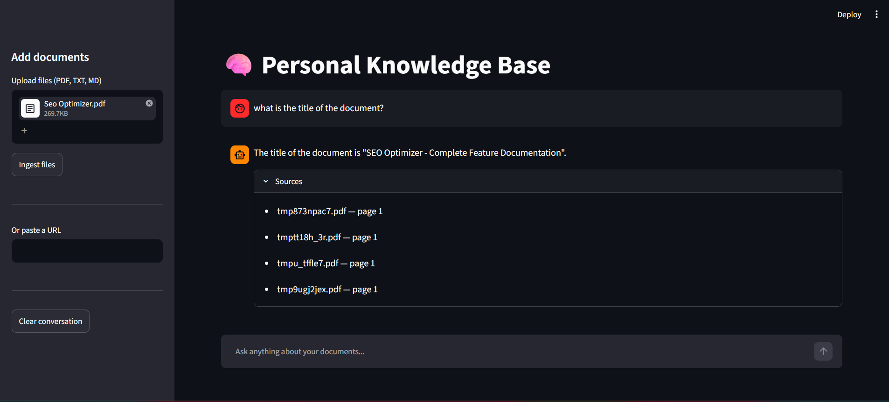
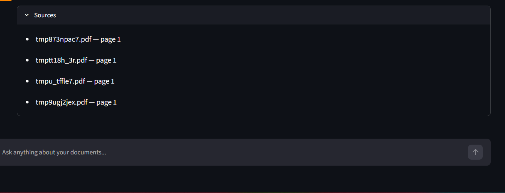
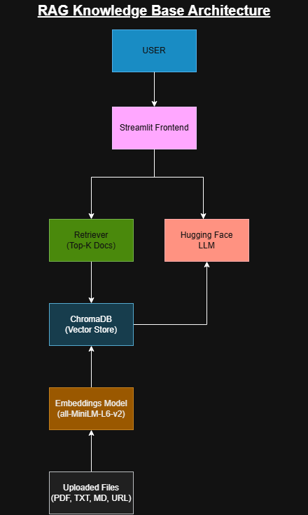

# 🧠 RAG Knowledge Base


An AI-powered Retrieval-Augmented Generation (RAG) application that enables users to upload documents and interact with them through natural language queries.

Built using **LangChain**, **ChromaDB**, **Hugging Face**, and **Streamlit**, this project combines semantic search with Large Language Models (LLMs) to provide accurate, context-aware answers grounded in uploaded documents.

## 🔗 Live Demo

Try the application here:

**Demo:** https://your-streamlit-link.streamlit.app

**GitHub:** https://github.com/adityaxgoswami/rag-knowledge-base

---

## 🚀 Features

* 📄 Upload and process PDF, TXT, and Markdown documents
* 🌐 Ingest content directly from URLs
* 🔍 Semantic document retrieval using vector embeddings
* 🤖 Context-aware question answering with Hugging Face LLMs
* 📚 Source attribution and page-level citations
* 💾 Persistent vector storage with ChromaDB
* 🎨 Interactive Streamlit web interface
* ⚡ Fast retrieval using embedding-based similarity search

---

## 📸 Demo

### Upload Documents

> Upload one or more documents to build your knowledge base.

```text
Supported formats:
- PDF
- TXT
- Markdown
```

**Screenshot**





---

### Ask Questions

Query your documents using natural language.

Example:

```text
What is the title of this document?
```

Response:

```text
The title of the document is
"SEO Optimizer - Complete Feature Documentation".
```

**Screenshot**





---

### Source Attribution

Every response includes references to the source document and page number.

Example:

```text
Sources

SEO Optimizer.pdf — page 1
SEO Optimizer.pdf — page 2
```

**Screenshot**





---

## 🏗️ System Architecture



The application follows a Retrieval-Augmented Generation (RAG) workflow:

1. Documents are uploaded and processed.
2. Text is split into chunks.
3. Chunks are converted into vector embeddings.
4. Embeddings are stored in ChromaDB.
5. User queries trigger semantic retrieval.
6. Relevant chunks are passed as context to the LLM.
7. The LLM generates grounded responses with source citations.

---

## 🛠️ Tech Stack

### Frontend

* Streamlit

### LLM Framework

* LangChain

### Vector Database

* ChromaDB

### Embeddings

* sentence-transformers/all-MiniLM-L6-v2

### Large Language Model

* Hugging Face Inference API
* ChatHuggingFace
* HuggingFaceEndpoint

### Document Processing

* PyPDFLoader
* TextLoader
* UnstructuredMarkdownLoader
* WebBaseLoader

---

## 📂 Project Structure

```text
rag-knowledge-base/
│
├── app.py
├── config.py
├── requirements.txt
├── .env.example
├── .gitignore
│
├── rag/
│   ├── chain.py
│   ├── ingest.py
│   └── retriever.py
│
└── README.md
```

---

## ⚙️ Installation

### 1. Clone Repository

```bash
git clone https://github.com/adityaxgoswami/rag-knowledge-base.git
cd rag-knowledge-base
```

### 2. Create Virtual Environment

```bash
python -m venv venv
```

Activate:

Windows

```bash
venv\Scripts\activate
```

Linux / Mac

```bash
source venv/bin/activate
```

---

### 3. Install Dependencies

```bash
pip install -r requirements.txt
```

---

### 4. Configure Environment Variables

Create a `.env` file:

```env
HUGGINGFACEHUB_API_TOKEN=your_huggingface_token
```

You can obtain a token from:

https://huggingface.co/settings/tokens

---

### 5. Run Application

```bash
streamlit run app.py
```

---

## 💡 Usage

### Upload Documents

* PDF
* TXT
* Markdown

### Ask Questions

Examples:

```text
What is the title of this document?

Summarize the key features.

What are the main modules described?

Explain the architecture.
```

### Ingest Web Pages

Paste a URL and ingest web content into the knowledge base.

---

## 📊 Retrieval-Augmented Generation Workflow

1. User uploads documents
2. Documents are chunked into smaller segments
3. Chunks are embedded using MiniLM embeddings
4. Embeddings are stored in ChromaDB
5. User asks a question
6. Relevant chunks are retrieved via semantic search
7. Retrieved context is sent to the LLM
8. LLM generates a grounded answer
9. Sources are displayed to the user

---
## 📊 Technical Metrics

| Metric               | Value                      |
| -------------------- | -------------------------- |
| Embedding Model      | all-MiniLM-L6-v2           |
| Vector Database      | ChromaDB                   |
| Retrieval Strategy   | Similarity Search          |
| Top-K Retrieval      | 4 Documents                |
| Supported Formats    | PDF, TXT, MD, URL          |
| Framework            | LangChain                  |
| Frontend             | Streamlit                  |
| LLM Provider         | Hugging Face Inference API |
| Programming Language | Python                     |

## 🔒 Security Notes

* API keys are stored in environment variables
* `.env` is excluded via `.gitignore`
* Chroma vector database is stored locally
* Uploaded documents are processed locally before embedding

---
## 🚧 Challenges & Learnings

Building this project involved several engineering challenges beyond simply integrating an LLM API.

### Challenges Faced

* Designing an effective Retrieval-Augmented Generation (RAG) pipeline to ensure responses remained grounded in uploaded documents.
* Determining appropriate chunk sizes and overlap values to balance retrieval quality and context preservation.
* Integrating Hugging Face Inference APIs with LangChain while handling model compatibility issues and endpoint constraints.
* Managing document metadata to provide accurate source attribution and page-level citations.
* Persisting embeddings in ChromaDB while supporting incremental document ingestion.
* Handling multiple document formats (PDF, TXT, Markdown, and URLs) through a unified ingestion workflow.

### Key Learnings

* Semantic search and vector similarity retrieval.
* Document preprocessing and text chunking strategies.
* Embedding generation using Sentence Transformers.
* Retrieval-Augmented Generation (RAG) architecture design.
* Prompt engineering for context-grounded responses.
* LangChain orchestration and retriever pipelines.
* Vector database management using ChromaDB.
* End-to-end deployment of AI applications with Streamlit.

## 📈 Project Highlights

* End-to-end Retrieval-Augmented Generation (RAG) system.
* Semantic document retrieval using vector embeddings.
* Source-grounded question answering with citations.
* Multi-format document ingestion (PDF, TXT, Markdown, URL).
* Persistent vector storage using ChromaDB.
* Interactive Streamlit-based user interface.
* Integrated Hugging Face LLMs through LangChain.

## 🎯 Future Improvements

* Conversation memory
* Multi-user support
* Document management dashboard
* Hybrid search (keyword + semantic)
* Support for DOCX and PowerPoint files
* OCR support for scanned PDFs
* Authentication and user workspaces
* Streaming responses
* Citation highlighting inside documents

---

## 👨‍💻 Author

**Aditya Goswami**

* GitHub: https://github.com/adityaxgoswami
* LinkedIn: https://www.linkedin.com/in/adityaxgoswami/
* Email: adityagoswami2424@gmail.com

---

## 📄 License

This project is licensed under the MIT License.

See the LICENSE file for details.
